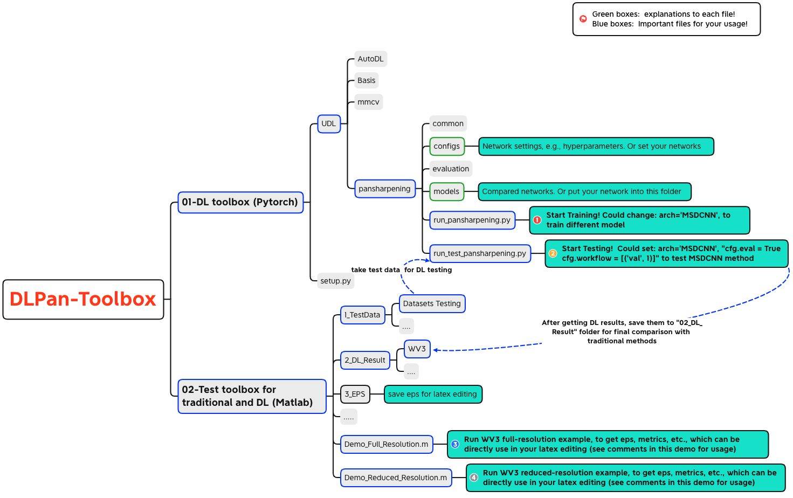

# DLPan-Toolbox

* This is a deep learning (DL) toolbox for pansharpening, which can be used for your training and testing, and easily get the comparison of traditional and DL methdos.

* You may find the relate [[paper]](https://github.com/liangjiandeng/liangjiandeng.github.io/tree/master/papers/2022/review-grsm2022.pdf) (see the following referenc [1]) which will be published in IEEE Geoscience and Remote Sensing Magazine, 2022.

## Introduction
This toolbox mainly contains two parts: one is the pytorch source codes for the eight DL-based methods in the paper (i.e., the folder of "01-DL toolbox (Pytorch)"); the other is the Matlab source codes which could simultaneously evaluate the performance of traditional and DL approaches in a uniformed framework ("02-Test toolbox for traditional and DL (Matlab)"). Please see more details:

- 01-DL toolbox (Pytorch): contains source codes of DL methods, you may check the ``readme`` file for the usage.
- 02-Test toolbox for traditional and DL (Matlab): contains Matlab source codes (mainly from 'Gemine et al., A New Benchmark Based on Recent Advances in Multispectral Pansharpenin: Revisiting Pansharpening With Classical and Emerging Pansharpening Methods , IEEE GRSM, 2021', see the following reference [2]) for simultaneously evaluating traditional and DL approaches and outputing results, you may check the ``readme`` file for the usage. 

Note that, readers also could check the structure and relationship of these two folders in the following ``overview figure`` (also find it in the respository).





## Citation
* [1] If you use this toolbox, please kindly cite our paper:

```bibtex
@ARTICLE{deng2022grsm,
author={L.-J. Deng, G. Vivone, M. E. Paoletti, G. Scarpa, J. He, Y. Zhang, J. Chanussot, and A. Plaza},
booktitle={IEEE Geoscience and Remote Sensing Magazine},
title={Machine Learning in Pansharpening: A Benchmark, from Shallow to Deep Networks},
year={2022},
pages={},
}
```


* [2] Also, the codes of traditional methods are from the "pansharpening toolbox for distribution", thus please cite the corresponding paper:
```bibtex
@ARTICLE{vivone2021grsm,
  author={Vivone, Gemine and Dalla Mura, Mauro and Garzelli, Andrea and Restaino, Rocco and Scarpa, Giuseppe and Ulfarsson, Magnus O. and   Alparone, Luciano and Chanussot, Jocelyn},
  journal={IEEE Geoscience and Remote Sensing Magazine}, 
  title={A New Benchmark Based on Recent Advances in Multispectral Pansharpening: Revisiting Pansharpening With Classical and Emerging Pansharpening Methods}, 
  year={2021},
  volume={9},
  number={1},
  pages={53-81},
  doi={10.1109/MGRS.2020.3019315}
}
```

## Acknowledgement
- We appreciate the great contribution of [Xiao Wu](https://xiaoxiao-woo.github.io/) and Ran Ran who are graduate students in [UESTC](https://www.uestc.edu.cn/) to this toolbox.

## License & Copyright
This project is open sourced under GNU General Public License v3.0.
